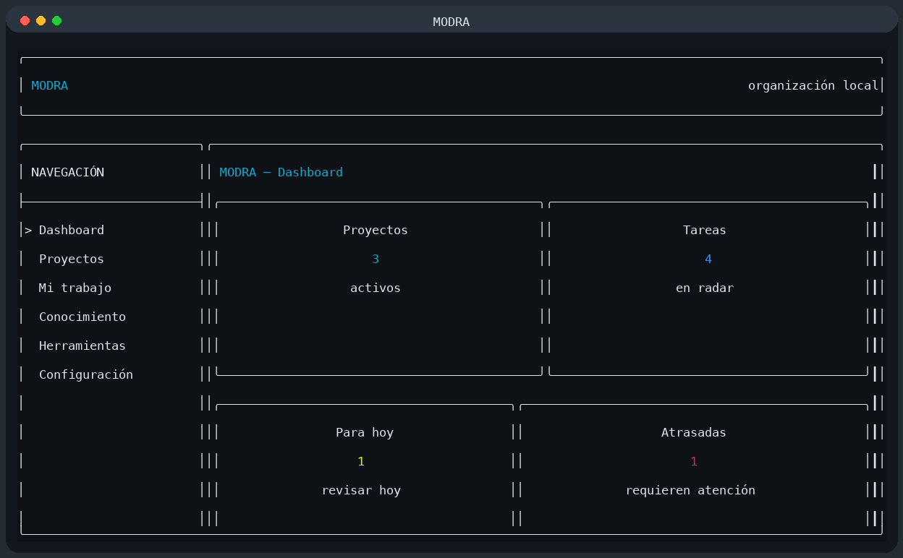
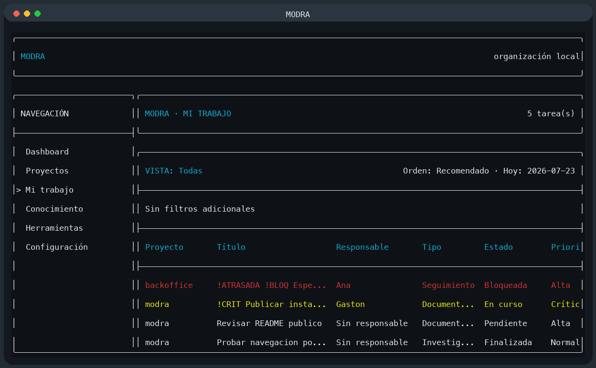
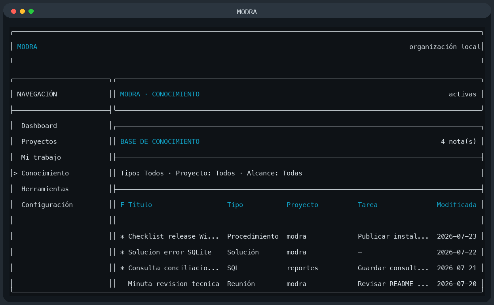

# MODRA



**MODRA** es una herramienta personal de consola para organizar proyectos, tareas en seguimiento y conocimiento técnico reutilizable. Está pensada como un centro local de control y memoria: ayuda a recordar qué revisar, qué está bloqueado, qué temas siguen abiertos y dónde quedó guardado el contexto importante.

[](https://isocpp.org/)
[](https://cmake.org/)
[](https://sqlite.org/)
[](#descarga)

## Descarga

Para instalar MODRA en Windows, descargá el instalador desde GitHub Releases:

**[Descargar MODRA para Windows](https://github.com/PricKG/MODRA/releases/latest/download/MODRA-Setup-0.1.0.exe)**

También podés descargar el checksum:

[MODRA-Setup-0.1.0.exe.sha256](https://github.com/PricKG/MODRA/releases/latest/download/MODRA-Setup-0.1.0.exe.sha256)

> Nota: el enlace directo funciona cuando la release publicada contiene los archivos `MODRA-Setup-0.1.0.exe` y `MODRA-Setup-0.1.0.exe.sha256`.

Después de instalar, abrí una terminal nueva y ejecutá:

```powershell
modra --version
modra doctor
modra
```

## Propósito

MODRA existe para responder rápido preguntas prácticas del trabajo diario:

- Qué proyectos y temas tengo en el radar.
- Qué tengo que revisar hoy.
- Qué seguimientos están atrasados.
- Qué está bloqueado y por qué.
- Dónde guardé una solución, consulta SQL, procedimiento o referencia técnica.

La pregunta guía del producto es:

> ¿Esto me ayuda a recordar, entender, revisar o encontrar información más rápido?

Si una funcionalidad no ayuda a eso, probablemente no corresponde a MODRA.

## Qué es y qué no es

MODRA es una aplicación local, personal y de un único usuario. Las tareas son tarjetas de seguimiento: pueden representar algo por hacer, algo por consultar, una respuesta pendiente, un bloqueo, una revisión futura o una referencia breve a un asunto externo.

MODRA no reemplaza Jira, GitHub Issues ni otras herramientas oficiales del equipo. Esas herramientas siguen siendo la fuente oficial de tickets, comentarios, asignaciones y flujos. MODRA guarda contexto personal y resumido para trabajar con menos fricción.

Fuera de alcance:

- Usuarios, roles, permisos o autenticación.
- Sincronización completa con Jira u otras plataformas.
- Comentarios encadenados, menciones o colaboración.
- Subtareas, dependencias complejas o Gantt.
- Catálogo formal de personas.
- Métricas de productividad, carga o rendimiento.
- Servidor web, nube o aplicación móvil.

## Capturas

Las siguientes capturas fueron generadas ejecutando MODRA con una base temporal de demostración.

### Dashboard


El dashboard resume lo que requiere atención: proyectos activos, tareas en radar, seguimientos de hoy, atrasos, bloqueos, prioridades críticas y notas favoritas.

### Mi trabajo



La vista **Mi trabajo** permite consultar tareas de todos los proyectos, filtrar por estado, prioridad, responsable textual, fecha de seguimiento y buscar por texto.

### Conocimiento



La sección **Conocimiento** guarda notas personales en Markdown dentro de SQLite. Una nota puede ser global o relacionarse opcionalmente con un proyecto y una tarea.

## Funcionalidades principales

- Dashboard informativo con seguimientos, bloqueos, prioridades y notas favoritas.
- Gestión persistente de proyectos.
- Tareas personales de radar asociadas directamente a proyectos.
- Responsable textual opcional, sin catálogo de personas.
- Vista global **Mi trabajo** con filtros, búsqueda y ordenamientos.
- Notas en Markdown para soluciones, minutas, SQL, configuraciones y referencias.
- Editor externo configurable para editar contenido largo.
- Archivado lógico y reversible de tareas y notas.
- Datos locales en SQLite.
- Migraciones SQL embebidas en el ejecutable.
- Logs locales y comando `doctor`.
- Instalador Windows por usuario.

## Uso básico

Ejecutá MODRA desde una terminal:

```powershell
modra
```

La interfaz mantiene una estructura fija: encabezado, menú lateral, panel principal y barra inferior de ayuda.

Navegación general:

- Flechas: cambiar selección.
- `Tab` o `→`: mover el foco al panel.
- `Esc` o `←`: volver al nivel anterior.
- `?`: abrir ayuda contextual.
- `q`: salir o volver, según el contexto.
- Atajos alfabéticos: no distinguen mayúsculas de minúsculas.

## Proyectos

Un proyecto agrupa contexto personal y elementos en seguimiento.

Campos principales:

- Nombre y alias.
- Descripción.
- Estado.
- Fecha inicial y fecha objetivo.
- Ruta local.
- Fechas de creación, actualización y archivado.

Estados disponibles:

- `planned`: Planificado.
- `active`: Activo.
- `paused`: En pausa.
- `completed`: Finalizado.
- `archived`: Archivado.

Atajos principales:

- `n`: crear proyecto.
- `e`: editar proyecto.
- `a`: archivar con confirmación.
- `v`: alternar activos y archivados.
- `/`: buscar por nombre o alias.
- `r`: recargar.
- `Ctrl+S`: guardar formulario.

## Tareas en radar

Una tarea de MODRA pertenece siempre a un proyecto. No hay módulos ni una capa intermedia.

Una tarea puede representar:

- Algo que hacer.
- Algo que revisar.
- Algo que consultar.
- Un tema bloqueado.
- Una respuesta pendiente.
- Una referencia simplificada a un ticket o asunto externo.

Campos principales:

- Proyecto obligatorio.
- Título.
- Descripción breve.
- Responsable textual opcional.
- Tipo, estado y prioridad.
- Fecha de seguimiento o límite.
- Motivo de bloqueo.
- Archivado lógico.

Tipos:

- `technical`
- `administrative`
- `management`
- `research`
- `documentation`
- `follow_up`

Estados:

- `pending`
- `in_progress`
- `blocked`
- `in_review`
- `completed`
- `cancelled`

Prioridades:

- `low`
- `normal`
- `high`
- `critical`

## Mi trabajo

**Mi trabajo** muestra tareas de todos los proyectos sin entrar proyecto por proyecto.

Vistas rápidas:

- `1`: Todas.
- `2`: Hoy.
- `3`: Atrasadas.
- `4`: Próximas durante los siguientes siete días.
- `5`: Bloqueadas.
- `6`: Finalizadas recientemente.
- `7`: Archivadas.

La búsqueda `/` incluye título, descripción, responsable, nombre del proyecto y alias del proyecto. Los filtros permiten combinar proyecto, responsable textual, tareas sin responsable, estado, tipo, prioridad y presencia de fecha.

## Conocimiento

La base de conocimiento guarda notas personales reutilizables:

- Soluciones a errores.
- Consultas SQL.
- Fragmentos de código.
- Procedimientos.
- Minutas.
- Configuraciones.
- Referencias técnicas.

Tipos de nota:

- `general`
- `technical`
- `solution`
- `meeting`
- `sql`
- `procedure`
- `configuration`
- `reference`

Las notas se editan como un documento Markdown completo mediante un editor externo. El primer encabezado `#` representa el título y el contenido posterior representa el cuerpo. MODRA conserva título y cuerpo por separado en SQLite, sin implementar un parser Markdown general.

Ejemplo de documento editable:

````md
<!--
MODRA_DOCUMENT_V1

Formato:
- El primer encabezado "# " es el título del documento.
- Todo lo que aparece después es el cuerpo en Markdown.
-->

# Problema de generación de PDF

## Contexto

El cierre mensual falla cuando se genera el reporte.

```sql
SELECT * FROM monthly_closures;
```
````

El editor se resuelve en este orden:

1. `editor.command` dentro de `config.json`.
2. Variable `VISUAL`.
3. Variable `EDITOR`.
4. `notepad.exe` en Windows; `nano` o `vi` en otros sistemas cuando estén disponibles.

Ejemplo de configuración:

```json
{
  "version": 1,
  "editor": {
    "command": "code --wait"
  }
}
```

## Datos locales

MODRA guarda sus datos localmente.

- Windows: `%LOCALAPPDATA%\MODRA`
- Linux: `$XDG_DATA_HOME/modra` o `~/.local/share/modra`
- macOS: `~/Library/Application Support/MODRA`

El directorio contiene:

- `modra.db`
- `config.json`
- `backups/`
- `exports/`
- `logs/`

El log principal se escribe en `logs/modra.log`.

## Compilar desde código fuente

Requisitos:

- C++20.
- CMake 3.24 o posterior.
- Git.
- En Windows: Visual Studio 2026 con la carga **Desktop development with C++**.

Configurar, compilar y ejecutar pruebas:

```powershell
cmake --preset debug
cmake --build --preset debug
ctest --preset debug
```

Ejecutar desde el repositorio:

```powershell
.\build\debug\Debug\modra.exe
.\build\debug\Debug\modra.exe --help
.\build\debug\Debug\modra.exe --version
.\build\debug\Debug\modra.exe doctor
```

CMake descarga dependencias fijadas mediante `FetchContent`: FTXUI, CLI11, SQLite, spdlog, nlohmann/json y Catch2.

## Generar el instalador Windows

El instalador release se genera en la raíz del proyecto:

```powershell
cmake --preset release-windows
cmake --build --preset release-windows
.\packaging\windows\BuildInstaller.ps1
```

Resultado esperado:

```text
MODRA-Setup-0.1.0.exe
MODRA-Setup-0.1.0.exe.sha256
```

El instalador usa IExpress, incluido en Windows. Instala MODRA por usuario en `%LOCALAPPDATA%\Programs\MODRA`, agrega esa carpeta al `PATH`, crea un acceso en el menú Inicio y registra MODRA en **Aplicaciones instaladas**. Al desinstalar, no elimina la base de datos ni los datos personales.

Para publicar una nueva descarga, subí ambos archivos como assets de una GitHub Release. El enlace directo del README apunta al asset de la última release publicada.

## Arquitectura

```text
src/
├── ui/              Pantallas, navegación y entrada.
├── application/     Casos de uso y coordinación.
├── domain/          Project, Task, Note y valores controlados.
└── infrastructure/  SQLite, configuración y sistema.
```

Componentes relevantes:

- `src/ui/`: interfaz FTXUI.
- `src/application/`: servicios de proyectos, tareas, dashboard y notas.
- `src/domain/`: entidades y enumeraciones controladas.
- `src/infrastructure/database/`: repositorios SQLite.
- `src/infrastructure/config/`: directorios de datos y configuración.
- `migrations/`: SQL versionado del esquema.
- `tests/`: pruebas unitarias e integración.

## Migraciones

Los archivos de `migrations/` son la única fuente de verdad del esquema. CMake los valida, ordena por versión y genera código C++ con el SQL embebido. El ejecutable no necesita leer archivos `.sql` en tiempo de ejecución.

Reglas del proyecto:

- No modificar migraciones ya aplicadas.
- Todo cambio real de esquema requiere una migración nueva y versionada.
- No duplicar SQL de migraciones dentro de código C++.
- Usar consultas parametrizadas.
- Las pruebas deben usar bases temporales, nunca datos reales.

## Roadmap

1. Revisión y alineación del producto.
2. Notas y base de conocimiento.
3. Captura rápida.
4. Seguimientos y recordatorios personales.
5. Referencias externas opcionales en tareas.
6. Comandos frecuentes.
7. Backups y restauración.
8. Consulta Git/SVN en modo lectura.
9. Exportaciones.
10. Mejoras basadas en uso real.

## Estado actual

Versión: `0.1.0`

Estado funcional:

- Base técnica implementada.
- Persistencia SQLite con migraciones.
- Gestión de proyectos y tareas.
- Dashboard informativo.
- Base de conocimiento con notas Markdown.
- Instalador Windows.
- Pruebas con Catch2.

Limitaciones actuales:

- No hay restauración de proyectos archivados.
- No hay etiquetas ni adjuntos en notas.
- No hay renderizado Markdown completo dentro de la UI.
- Los filtros y ordenamientos no se guardan entre ejecuciones.
- Git/SVN, backups, exportaciones y comandos frecuentes están en roadmap.

## Licencia

El repositorio todavía no declara una licencia explícita. Antes de distribuir MODRA públicamente, agregá un archivo `LICENSE` con la licencia elegida.
